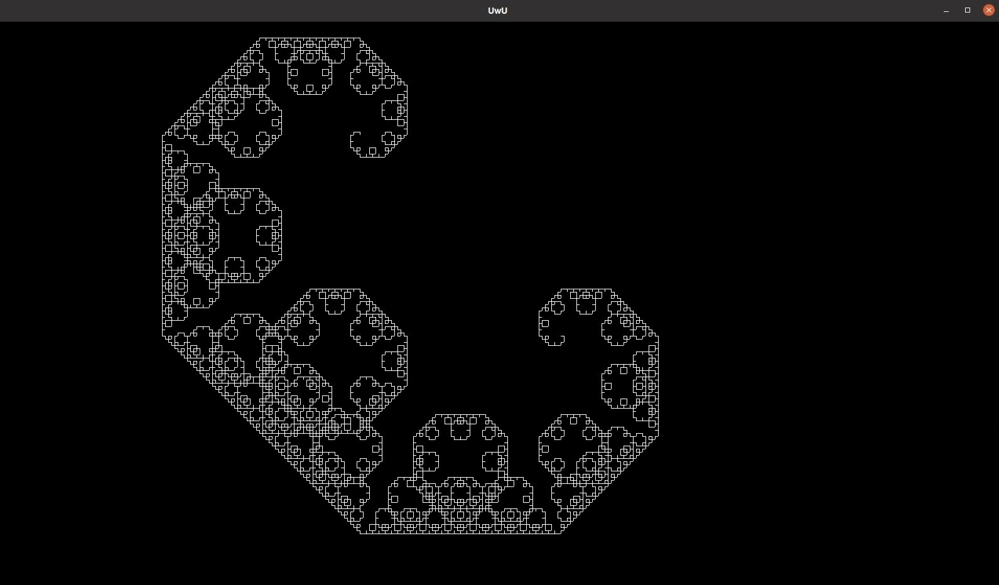

# Библиотека для работы с 2D графикой
## Составляющие библиотеки:
+ Класс Matrix
+ Класс Vector
+ Класс Point
+ Класс Render

## Описание каждого класса:
1. **Matrix** - поддерживает стандартные операции с матрицами. Конструкторы, поддерживаемые данным классом:

        Matrix(int *вертикальный размер*, int *горизонтальный размер*, float* *массив чисел, входящих в матрицу*);
        Matrix(int *вертикальный размер*, int *горизонтальный размер*, float *значение диагональных элементов, если матрица квадратная*);
        Matrix(FILE* *файл, в котором хранится матрица*);  
2. **Vector** - поддерживает стандартные операции с векторами. Конструкторы, поддерживаемые данным классом:

        Vector(float *x координата*, float *y координата*);
        Vector(float *x координата*, float *y координата*, float *z координата*);
        Vector(int *количество координат*, float* *массив чисел, входящих в вектор*);
        Vector(Point& *начальная точка вектора*, Point& *конечная точка вектора*);
3. **Point** - поддерживает сравнение точек и нахождение дистанции между ними. Конструкторы, поддерживаемые данным классом:

        Point(float *x координата*, float *y координата*);

        Point(float *x координата*, float *y координата*, float *z координата*);

        Point(int *количество координат*, float* *массив чисел, входящих в вектор*);

4. **Render** - создан для упрощения работы с графикой на базе SFML. Основным преимуществом является работа с отдельными пикселями с помощью функций:

        void set_pixel_color(int *x координата* ,int *y координата*, sf::Color *цвет пикселя*);
        sf::Color get_pixel_color(int *x координата* ,int *y координата*);  

    Для работы с событиями используется функция:

        void check_event();

    В ней прописана обработка элементарных событий окна.

    Для работы с кадрами используются функции:
    
        void new_frame(sf::Uint8* *массив пикселей, который будет загружен в объект класса и затем отрисован*, int *размер по x*, int *размер по y*);

        void new_fast_frame(sf::Uint8* *массив пикселей, который будет отрисован без загрузки в объект*);

        void hold_frame(); //отрисовывает кадр по массиву пикселей, находящемуся в объекте класса

    Каждая функция отрисовки поддерживает контроль частоты кадров. Для установки количества выводов изображения на экран используется функция:

        void set_frame_rate(int *количество кадров в секунду*); //для отключения контроля нужно ввести отрицательное число кадров(не 0)

## Пример использования класса:

Программа рисует кривую Леви:

Код программы:

    #include "visual_lib/headers/Render.hpp"
    #include "vector_lib/headers/Vector_lib.hpp"
    #include <iostream>

    #define HOR_SIZE 1200
    #define VERT_SIZE 500
    #define VECTOR_LEN 5

    Matrix ninety_degree_rotation(){

        float tmp_data[4] = {0, -1, 1, 0};
        Matrix rotation_matr(2, 2, tmp_data);

        return rotation_matr;
    }

    Point draw_line(Point base_point, int number_of_rotation, Render& cur_canvas){

        Matrix rot_matrix(2, 2, 1);
        Vector vector_of_line((float)VECTOR_LEN, 0);
        Point end_point(base_point);

        for (int i = 0; i < number_of_rotation; i++){

            rot_matrix = rot_matrix * ninety_degree_rotation();
        }

        vector_of_line = rot_matrix * vector_of_line ;
        cur_canvas.draw_segment(base_point, vector_of_line, 1);

        end_point[0] += vector_of_line[0];
        end_point[1] += vector_of_line[1];

        return end_point;
    }

    Point fractal(int iteration_number, int number_of_rotation, Point cur_base_point, Render& cur_canvas){

        Point tmp_point(2, -1);
        
        number_of_rotation = number_of_rotation % 4;

        if (iteration_number > 1){

            tmp_point = fractal(iteration_number - 1, number_of_rotation, cur_base_point, cur_canvas);
            tmp_point = fractal(iteration_number - 1, number_of_rotation + 1, tmp_point, cur_canvas);

            return tmp_point;
        } else{

            return draw_line(cur_base_point, number_of_rotation, cur_canvas);
        }
    }

    int main(){ 

        Render new_window(HOR_SIZE, VERT_SIZE);
        Point base_point(900, 500);
        
        new_window.set_brush_color(sf::Color::White);

        fractal(14, 0, base_point, new_window);

        while (new_window.check_open() == true){

            new_window.hold_frame();

            new_window.check_event();
        }
    }

